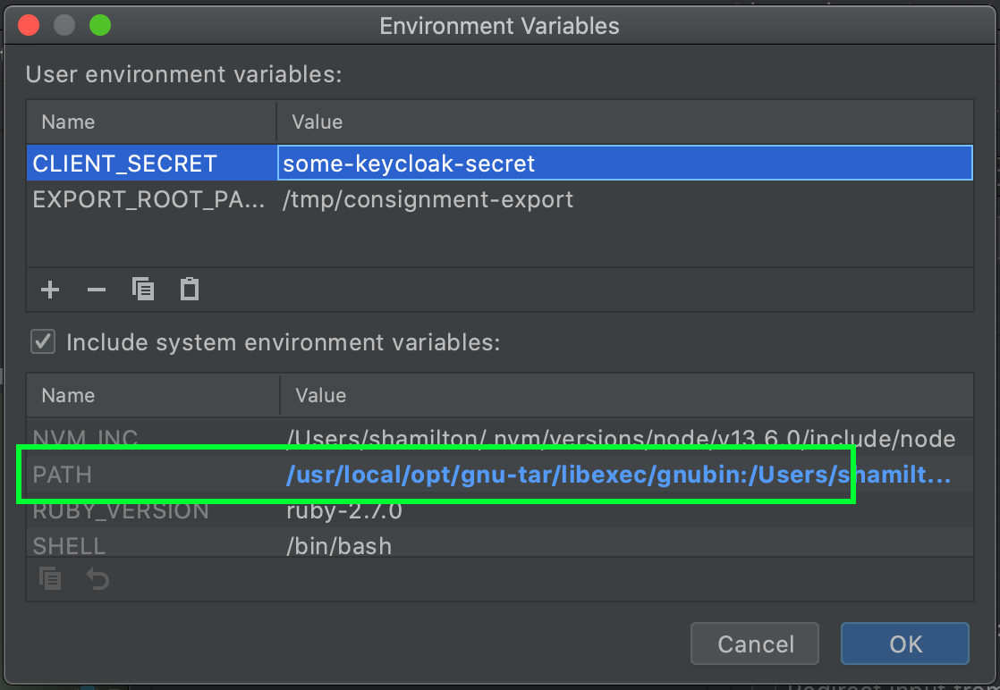

## Consignment Export
This is the project which contains the code for the consignment export. 

The infrastructure for the export, is defined in the [terraform]("https://github.com/nationalarchives/tdr-terraform-environments") repository.
* The front end makes a request to the api gateway with the user's token
* A lambda authorises the request using the consignment api to check the token
* Api gateway triggers a step function
* The step function triggers an ECS task which runs the code in this repository.

The code in this repository does the following:
* Calls the API to get a list of files
* Downloads the files from S3 to the EFS volume
* Creates the Bagit bag
* Tar and zip the bag
* Create a checksum file for the tar file
* Upload to the export bucket.
* Update the API with the export location

The code for the authoriser is in the [tdr-consignment-export-authoriser](https://github.com/nationalarchives/tdr-consignment-export-authoriser) project


### Running Locally

Set the `CLIENT_SECRET` environment variable to the client secret for the tdr-backend-checks Keycloak client in the integration environment, which you can find by logging into Keycloak or by running the AWS CLI with intg credentials:

```
aws ssm get-parameters  --names "/intg/keycloak/backend_checks_client/secret"  --with-decryption
```

Set the `EXPORT_ROOT_PATH` environment variable to a path on your machine which the task can use to download files and prepare the Bagit package. For example, `/tmp/consignment-export`.

You can then run the Main object in Intellij as you can with any similar project. You will need to provide the program arguments: `export --consignmentId {a uuid}`

You can also run `sbt universal:packageZipTarball` which creates a file `target/universal/tdr-consignment-export.tgz` which, when unzipped, gives you a `bin/tdr-consignment-export` executable which you can run with the same arguments as above. This is how the docker container runs the file so is the closest to running this in production.

### Deployment
Because this is run as an on demand ECS task, deployment is just pushing a new version of the docker image to ECR with the appropriate stage tag. This will be done by Jenkins as part of the deploy job on merge to master so there should be no reason to do this locally.

### Tests

Run `sbt tests` to run the tests in both projects.

The exporter tests write temporary files to the directory defined in `efs.rootLocation` in the test application.conf. By default, it uses the `/tmp` directory. To use a different directory, set the `SCRATCH_DIRECTORY` environment variable when running the tests.

### Troubleshooting

You might see this error if your `tar` installation is not GNU Tar, since some Unix OSes like MacOS use a different `tar` by default:

```
tar: Option --sort=name is not supported
```

You can fix this by installing GNU Tar and making sure it is on your path when you run the project.

On a Mac with Homebrew:

* Run `brew install tar`
* Add `/usr/local/opt/gnu-tar/libexec/gnubin:`, to the **beginning** of your `PATH` environment variable so that Scala can run the GNU version of tar. If you're  doing this in IntelliJ, it looks like this:


